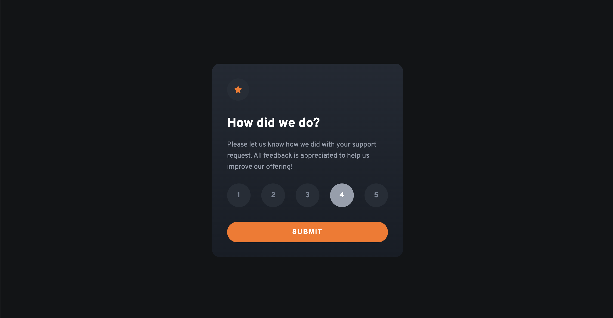
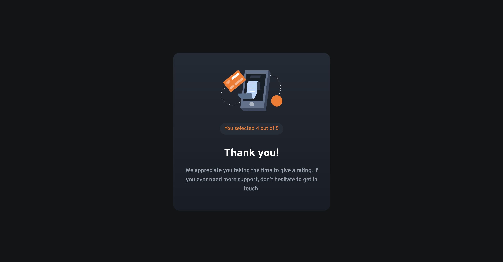

# Interactive rating component solution

This is a solution to the [Interactive rating component challenge on Frontend Mentor](https://www.frontendmentor.io/challenges/interactive-rating-component-koxpeBUmI).

## Table of contents

- [Overview](#overview)
  - [The challenge](#the-challenge)
  - [Screenshot](#screenshot)
  - [Links](#links)
- [My process](#my-process)
  - [Built with](#built-with)
  - [What I learned](#what-i-learned)
  - [Continued development](#continued-development)
- [Author](#author)

## Overview

### The challenge

Users should be able to:

- View the optimal layout for the app depending on their device's screen size
- See hover states for all interactive elements on the page
- Select and submit a number rating
- See the "Thank you" card state after submitting a rating

### Screenshot




### Links

- [Solution on frontendmentor.io]()
- [Live preview]()

## My process

### Built with

- Semantic HTML5 markup
- CSS custom properties
- Flexbox
- CSS Animations
- Mobile-first workflow
- BEM methodology
- JavaScript

### What I learned

This project was fun from few different points of view. First of all it was nice to connect **block** classes in BEM so, I could style it independently. 

Second of all animations! Everyone loves it, and it improves User Experience so, that's definitely something I can focus on in the future. I don't do it often and what comes with it at the beginning it's like building something with LEGO bricks and see what's going to happen. Overall, a lot of fun!

Third and last thing is getting value from form using JavaScript. I didn't want to just get checked element so, I did a research and found *FormData* constructor which came handy. It's always good to get to know different approaches of same functionality.

Below you can see few lines of code which helped with animating these components. Not really a skyrocket science, but if someone didn't know about *animationend* then there you go:

```js
rating.addEventListener('animationend', () => {
  rating.classList.remove('rating--visible')
  feedback.classList.add('feedback--visible');
});
```

### Continued development

I had a chance to add animations here, but I don't do very often because mostly I create business applications. I would love to focus more on adding motion in project to become more comfortable when using it.

## Author

- Github - [@PiwkoO](https://github.com/PiwkoO)
- Frontend Mentor - [@PiwkoO](https://www.frontendmentor.io/profile/PiwkoO)